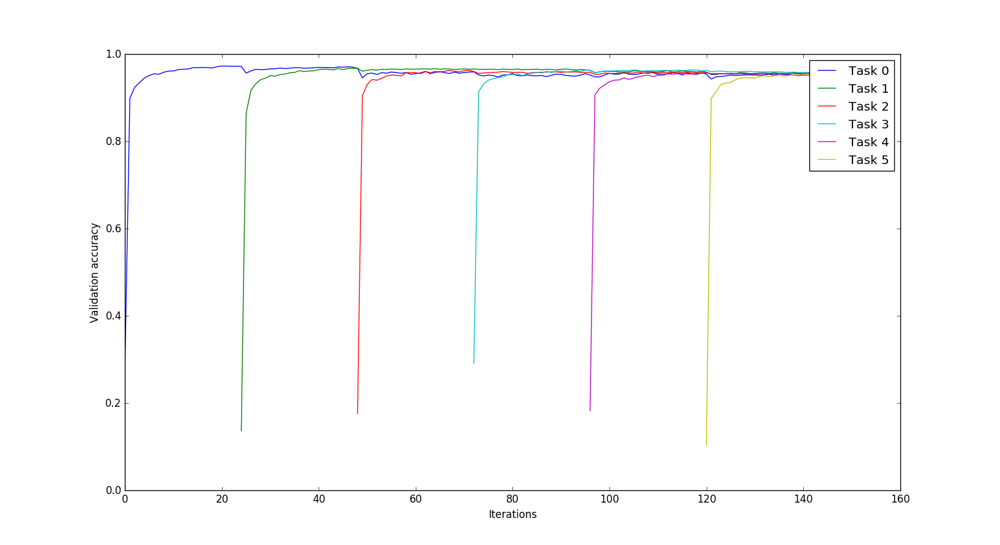
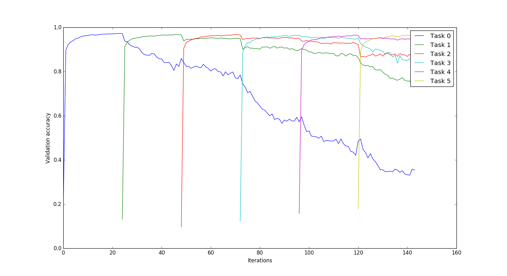

# cata-forget

Methods to reduce catastrophic interference in neural networks

1. Elastic Weight Consolidation

5 MNIST permutation tasks with EWC+Dropout:

Same tasks without EWC (only SGD+Dropout):

Saturation behavior

With EWC:

Without EWC (SGD+dropout):

Selectively forgetting (here, tasks 0,2,3):

