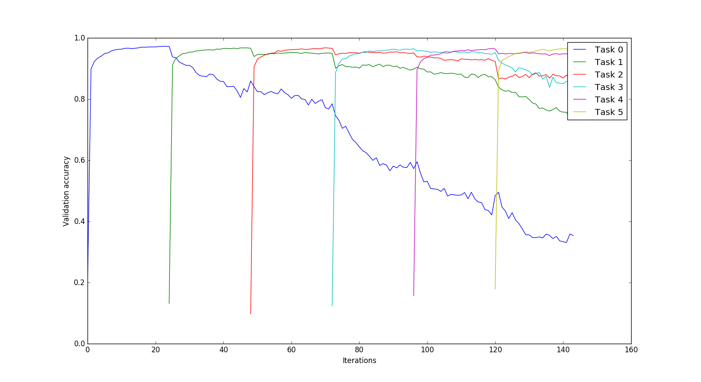
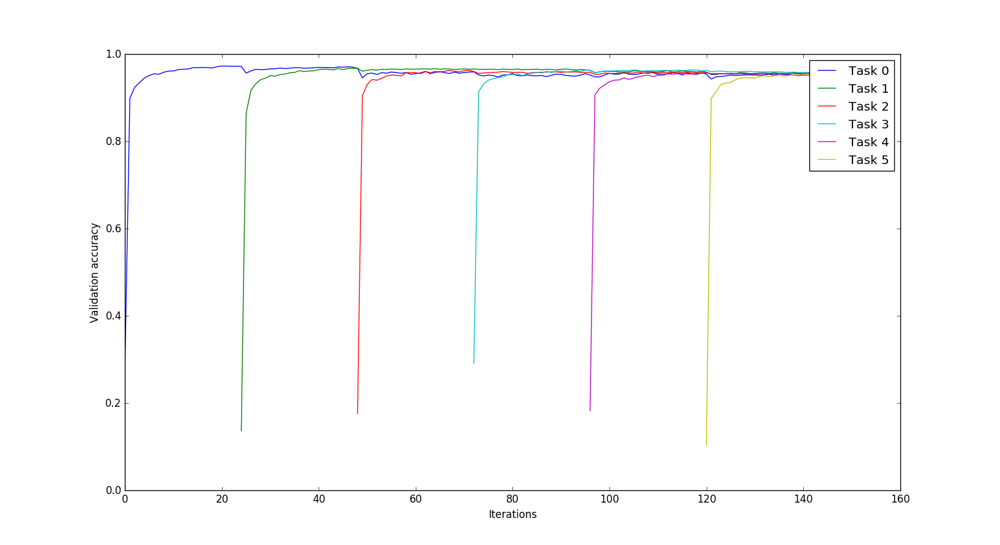

# Selectively Forgetting Tasks with Elastic Weight Consolidation

Elastic Weight Consolidation (https://arxiv.org/abs/1612.00796) allows a parameterized model to sequentially learn tasks with independent data. This project: (1) reproduces the results of the EWC paper (2) studies the saturation behavior of models (performance as more tasks are learned) and (3) implements a simple modification in the algorithm to learn tasks and then selectively forget some to free capacity.

The full report for the project can be seen here: <link to report>

Elastic Weight Consolidation paper reproduction:

Use a large model (2 hidden layers, 1000 units each):

   * 5 permuted MNIST tasks with only SGD+Dropout:
   

   * Same tasks with EWC:
   

To recreate the permuted MNIST experiments, run `mnist_permute_exp.py` (usage instructions in the script). This will produce the following results:

Saturation behavior: Use a smaller model (2 hidden layers, 100 units each):

   * With EWC: Note the drop in accuracy for new tasks as the small model tried to remember all the previous tasks

   * Without EWC (SGD+dropout): Plain SGD causes the model to forget all previous tasks

   * Selectively forgetting (here, the "forget policy" was: after task 4, forget tasks 0, 1, 3, 5). Note the drop in validation accuracies for these tasks while the accuracy for task 2 remains the same.

Weight Correlation Matrices:
1. Without forgetting (remembering all tasks)
2. With forgetting

