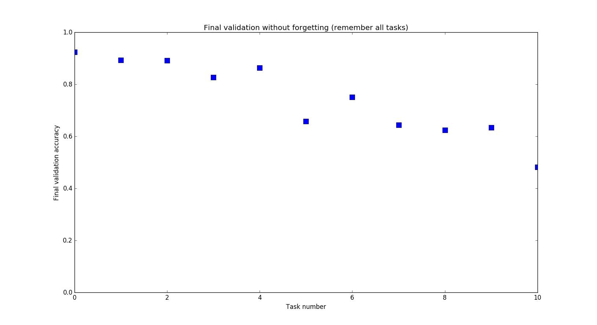

# Selectively Forgetting Tasks with Elastic Weight Consolidation

Elastic Weight Consolidation (https://arxiv.org/abs/1612.00796) allows a parameterized model to sequentially learn tasks with independent data. This project: (1) reproduces the results of the EWC paper (2) studies the saturation behavior of models (performance as more tasks are learned) and (3) implements a simple modification in the algorithm to learn tasks and then selectively forget some to free capacity.
The full report for the project can be seen [here](http://prithvijc.pythonanywhere.com/selForgetting.pdf)

Elastic Weight Consolidation paper reproduction: Validation curves on using standard EWC with a large model (2 hidden layers, 1000 units each):

   * 5 permuted MNIST tasks with only SGD+Dropout:
   

   * Same tasks with EWC:
   

The model is large enough to all 5 independent tasks. As the tasks are learned sequentially, their validation accuracies converge and then stay constant.

To recreate the permuted MNIST experiments, run `mnist_permute_exp.py` (usage instructions in the script). This will run the experiment on the saturation behaviour of the model. This uses a smaller model (2 hidden layers, 100 units each):

   * With EWC: Note the drop in accuracy for new tasks as the small model is forced to remember all previous tasks
  

    
    
  

   * Without EWC (SGD+dropout): Plain SGD causes the model to forget a task as soon as it is trained on another
  

    
    
  

   * Selectively forgetting (here, the "forget policy" was: after task 4, forget tasks 0, 1, 3, 5). Note the drop in validation accuracies for these tasks while the accuracy for task 2 remains the same.
  

    
    
  

The script also displays a visualization of the Fisher Information Matrices for selected tasks and shows the weight correlation matrices after training on all tasks (the report describes these in detail).

